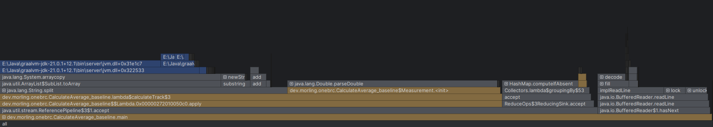

版本 | time
---- | ---
baseline | 247906ms
TrackMMap.java | 51103ms
TrackThread.java | 6828ms
GraalVM | 3122ms

# 基线火焰图

# 优化1: IO优化
利用mmap减少BufferedReader多次读取文件字符串

# 优化2: 减少字符串强转
发现paraseDouble占用特别大，我可以利用数据只保留一位小数前提下，将文本中读取到的字节码转为int运行，避免字符串重复拷贝

# 优化3: 多线程处理
可以利用多线程分割文件，同时去计算每个分块中最小，最大，总和

# 优化4：GraalVM
本机运用GraalVM可以缩小到3s左右

# 大佬优化
## 自定义哈希表
指定大小：不需要考虑容量扩张，因为比赛的气象站大小已经确定
开放地址法：如果hash值对应的槽位（slot）已经存在，那么一直向右移动到第一个空的槽位
计算hash值和判断key是否相等：直接通过读取文件对应字节计算和判断，避免创建String对象

# 作者提醒的优化方向:
1.使用sun.misc.Unsafe取代MemorySegment，避免边界校验
2.避免重新重新读取同一个字节：复用已经加载的值做哈希计算和分号搜索
3.一次处理8个字节，使用SWAR技术搜索分号
4.通过统计气象站名称长度分布，优化名称比较的分支预测命中率

# 具体规则和查看官方README2.md